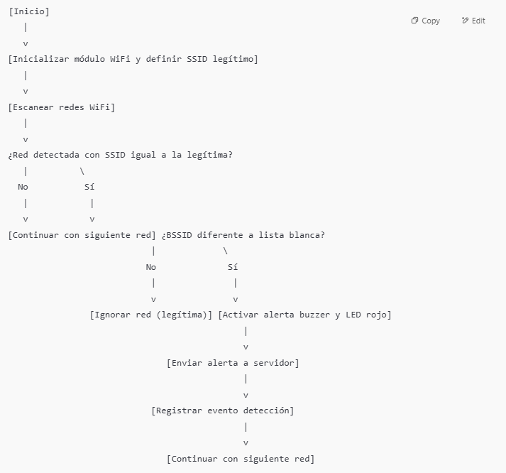

# Soluciones IoT para Detección y Mitigación de Riesgos en Ciberseguridad

## integrantes 

1.	Andrés Camilo Molano Mendieta
2.	Oscar Vega
3.	Enrique Ramírez
4.	Raúl Gray


## Solución 1: Sistema de Detección de Intrusos con Autenticación Segura


### Descripción funcional

**Hardware:** Arduino UNO, sensor PIR (detección de movimiento), módulo Wi-Fi ESP8266 para conexión a red, LED verde y rojo, buzzer para alarma sonora.

**Funcionalidad:**  
1. El sensor PIR detecta movimiento dentro de un área restringida.  
2. Cuando se detecta movimiento, el sistema solicita una autenticación mediante ingreso de clave digital (por ejemplo, desde un keypad o interfaz remota).  
3. Si la clave es válida, se apaga la alarma y el LED verde indica acceso autorizado.  
4. Si la clave es inválida, el sistema activa alarma sonora (buzzer) y LED rojo.  
5. El sistema envía una alerta cifrada a un servidor seguro mediante Wi-Fi.  
6. Registra eventos (fecha, hora, tipo de evento) en memoria con cifrado básico para mantener la confidencialidad.


# Diagrama de flujo




### Algoritmo en pseudocódigo estructurado

```plaintext
Inicio
  Inicializar sensor PIR, módulo Wi-Fi, buzzer, LEDs, y sistema de registro cifrado
  Esperar detección de movimiento

  Mientras (true) hacer
    Si sensor PIR detecta movimiento entonces
       Solicitar ingreso de clave digital
       Leer clave ingresada
       Si clave es válida entonces
          Encender LED verde
          Apagar buzzer y LED rojo
          Registrar evento "Acceso autorizado" con marca de tiempo (cifrado)
       Sino
          Encender LED rojo
          Activar buzzer
          Enviar alerta cifrada al servidor vía Wi-Fi
          Registrar evento "Alerta intrusión" con marca de tiempo (cifrado)
       Fin Si
    Fin Si
    Esperar breve periodo antes de siguiente lectura
  Fin Mientras

Fin

